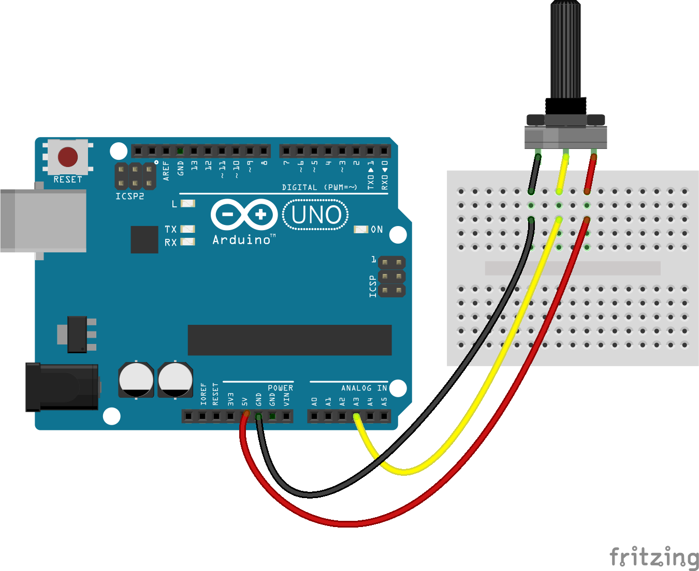

# `potentiometer-drive`
# Conduire votre kart avec un potentiomètre 

Cette mise en pratique est un exemple fonctionnel pour comprendre et utiliser un capteur servant à piloter votre kart pour de vrai.

Dans cet exemple, vous allez utiliser un potentiomètre qui vous permettra d'aller à gauche, tout droit ou à droite. Grâce à cet exemple, vous maîtriserez la mise en marche de votre dispositif que vous pourrez reproduire avec votre propre script cette semaine.

## 1. Créer le proto-dispositif

Pour l'exemple, ce sera un simple potentiomètre. Voici les branchements à effectuer :

✅ **L'utilisateur peut interagir avec un objet.**

## 2. Démarrer le script-serveur

1. Ouvrir une nouvelle fenêtre du Terminal
2. Taper `cd ` puis faire glisser votre dossier `📁ihm2019` sur la fenêtre du Terminal puis valider
3. Taper `cd server && python3 ./STK_input_server.py` : après quelques secondes, ce message va apparaître _STK input server started_. Laisser la fenêtre de Terminal tourner.

✅ **Le script-serveur est en place et fonctionnel. Il est donc prêt à recevoir des instructions pour simuler les touches de clavier.**

## 3. Démarrer SuperTuxKart

1. Double-cliquer sur l'application précédemment téléchargée **`supertuxkart.app`** et lancer le jeu
2. Lancer une partie (solo ou en réseau) et dès que vous êtes sur la ligne de départ, ne faites rien (ou jouez un tour si vraiment vous avez envie) : l'objectif est d'être en mode jeu pour que les touches de clavier simulées se répercutent sur la conduite de votre kart (et pas sur les menus du jeu).

✅ **Le jeu est prêt à recevoir des appuis de touches de clavier.**

## 4. Lancer le script

1. Créer un dossier `📁potentiometer-drive` sur le Bureau du Mac
2. Copier-coller [le script de l'exemple](02-potentiometer-drive.js) dans un fichier `02-potentiometer-drive.js` à enregistrer dans ce même dossier `📁potentiometer-drive`
3. Ouvrir le Terminal
4. Taper `cd ` puis faire glisser le dossier `potentiometer-drive` sur le Terminal, puis valider
5. Taper `npm install --save johnny-five dgram`
6. Puis taper `node 02-potentiometer-drive.js` pour lancer votre script

Vous verrez s'afficher les valeurs de votre potentiomètre en direct. Prenez le temps d'explorer le script pour décortiquer la logique d'interprétation de la valeur du potentiomètre :

✅ **Votre script est lancé et envoie en continu des instructions au script-serveur.**

## 5. Aller vite dans SuperTuxKart

⚠ **Note importante** : à partir de maintenant, votre Mac appuie tout seul sur des touches de clavier. Pour jouer, vous devez **toujours** avoir le focus dans la fenêtre de jeu SuperTuxKart. Puisque le script-serveur simule des touches de clavier, il les simule où que soit votre curseur. Autrement dit, si la fenêtre active est le Terminal au lieu du jeu, et que votre script-serveur simule la touche <kbd>↑</kbd>, vous allez vous déplacer tout seul vers le haut dans votre Terminal.

1. Cliquer sur la fenêtre de jeu SuperTuxKart et garder cette fenêtre active

✅ **Votre chaînage de script permet maintenant de contrôler le kart dans le jeu directement.**

## 6. 🏁 Jouer ! 🏁

1. Tourner le potentiomètre à gauche, au milieu ou à droite pour contrôler votre kart 👍

-----

# 🚨 Panic button : comment arrêter les scripts pour ne plus appuyer tout seul sur les touches de clavier ?

C'est normal si c'est chaotique, rassurez-vous.

Pendant que votre ordinateur va s'entêter de simuler un appui sur une touche de clavier, vous allez devoir stopper l'exécution de votre script. Pour cela, cliquer dans la fenêtre de Terminal de votre script (pas la fenêtre du script-serveur qui continue de tourner en fond) et faire le raccourci <kbd>Ctrl</kbd> + <kbd>C</kbd> 2 fois de suite rapidement. Cela va arrêter votre script et stopper l'envoi d'instructions au script-serveur.

Ainsi, vous pouvez éditer votre script, modifier du code, enregistrer le fichier, et revenir dans le Terminal. 

Quand vous êtes prêt et que le jeu SuperTuxKart est prêt, retaper `node 02-potentiometer-drive.js` dans le Terminal et valider : votre script recommence à envoyer des instructions au script-serveur qui se remet à simuler l'appui sur les touches du clavier. Pensez bien à redonner le focus à la fenêtre de jeu SuperTuxKart pour que les touches appuyées contrôlent votre kart et pas une autre fenêtre du Mac.

